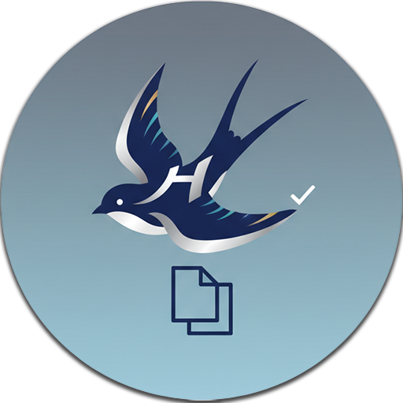

# HienMark

> HienMark is a modern and powerful task editor that runs on your local file system.

**ローカルファースト タスク管理エディタ**

Markdownファイルをタスクとして扱い、YAML Front Matterによるタグベースの管理と、EChartsによる視覚的な分析を統合したタスク管理エディタです。



## 特徴

- 📝 **Markdown編集** - 1ファイル = 1タスクのシンプルな管理
- 🏷️ **強力なタグシステム** - 型付きタグによる高度なメタデータ管理
- 📊 **視覚的分析** - EChartsによるガントチャート、円グラフ、棒グラフなど
- 🔒 **ローカルファースト** - クラウド不要、完全オフライン動作
- ⚡ **高速・軽量** - Tauri採用で高速起動、低メモリ消費
- 🔐 **セキュア** - XSS対策、DOMPurify、Mermaid セキュリティレベル設定
- 🌍 **多言語対応** - 日本語、英語、ベトナム語をサポート
- 🎨 **カラーテーマ** - ダークモード/ライトモードの切り替え

## プロジェクトステータス

**バージョン:** 0.1.0
**完成度:** 97%（実用レベル達成）

主要機能は実装済みで、実際に使用可能な状態です。

## 技術スタック

- **フレームワーク:** Tauri 2.9.1
- **フロントエンド:** React 18.3 + Vite 6.4 + TypeScript 5.7
- **バックエンド:** Rust 1.90
- **エディタ:** CodeMirror 6
- **Markdownパーサー:** comrak 0.33
- **ダイアグラム:** ECharts 5.5 + mermaid.js 11.4
- **セキュリティ:** DOMPurify 3.2
- **国際化:** i18next 24.2

## セットアップ

### 必要な環境

- Node.js 20.x以上
- Rust 1.77以上
- Visual Studio Build Tools（Windows）/ Xcode（macOS）/ GCC（Linux）

### インストール

```bash
# リポジトリクローン
git clone https://github.com/yourusername/hienmark.git
cd hienmark

# 依存関係インストール
npm install

# 開発サーバー起動
npm run tauri dev
```

### ビルド

```bash
# 本番ビルド
npm run tauri build
```

生成されたバイナリは `src-tauri/target/release/` に出力されます。

## クイックスタート

### 1. ワークスペースを開く
初回起動時に、タスクファイルを保存するディレクトリを選択します。

### 2. タスクを作成
「新規タスク」ボタンで新しいMarkdownファイルを作成できます。テンプレートを選択して、事前定義されたタグを適用することも可能です。

### 3. タグを編集
右パネルのタグエディタで、タスクのメタデータ（ステータス、優先度、期限など）を設定します。タグは型付きで、適切な入力UIが自動生成されます。

### 4. Markdown編集
CodeMirror 6エディタで本文を編集します。Mermaidダイアグラムも記述可能で、リアルタイムでプレビューされます。

### 5. 分析ダッシュボード
「分析」タブで、タスク全体の進捗をガントチャートや円グラフで可視化できます。

### タスクファイル例

```markdown
---
status: in_progress
priority: high
due_date: 2025-11-15
start_date: 2025-11-01
assignee: developer
---

# HienMark v1.0リリース準備

## 概要
初回リリースに向けた最終調整とドキュメント整備を行う。

## タスク
- [x] バグ修正
- [x] ドキュメント作成
- [ ] パフォーマンステスト
- [ ] リリースノート作成

## 依存関係

```

---

## 主要機能

### ✅ 実装済み

- **タスクエディタ**
  - CodeMirror 6による高機能Markdown編集
  - リアルタイムプレビュー（分割表示）
  - Mermaidダイアグラムのレンダリング
  - 自動保存（3秒デバウンス）

- **タグシステム**
  - 型付きタグ（String, Number, Boolean, Date, Select, MultiSelect等）
  - タグテンプレート機能
  - タグ管理UI（リネーム、削除、統計）
  - ドラッグ&ドロップによる順序変更

- **分析ダッシュボード**
  - ガントチャート（依存関係表示付き）
  - 円グラフ（タグ値分布）
  - 棒グラフ（カテゴリ統計）
  - 折れ線グラフ（時系列分析）

- **その他**
  - ファイルウォッチャー（外部変更のリアルタイム検出）
  - 多言語対応（日本語/英語/ベトナム語）
  - カラーテーマ（ダーク/ライト）
  - レスポンシブUI

### ✅ 最近実装完了

1. タスクのソート・フィルタ機能
2. タグ逆引き機能
3. タグ管理の検索・フィルタ機能
4. グラフのエクスポート機能（PNG/SVG）
5. フィルター/ソート機能とタグ属性システムの連携

### 🚀 HienMark 実装予定ロードマップ

#### 1. 優先度【高】 (最優先タスク)

アプリケーションの基盤安定化と、中核となる編集機能・整理機能の改善を最優先とします。

1.1 基盤の安定化・刷新
* **タスクリストのSQLite化:**
    パフォーマンスを最適化し、将来の高度な機能（高速な検索、ソート）に備えるための根本的な対応。
* **Mermaidの削除:**
    バグの原因となっている分析画面の作図エンジンを削除し、安定性を確保。

1.2 コア編集機能の強化 (WYSIWYG)
* **ビジュアルビューへのWYSIWYG編集機能追加:**
    Markdownに不慣れなユーザーでも直感的に編集できるようにする。
* **双方向同期:**
    ビジュアルビューでの編集結果が、正しくMarkdownに反映されるようにする。
* **テーブル編集機能:**
    WYSIWYG内でテーブルを簡単に編集し、日本語などの多バイト文字でも可読性を維持する。
* **アセット管理機能 (新規):**
    画像やファイルをタスクに埋め込み/リンクした際、そのファイルを自動的にWorkspace（プロジェクトフォルダ）内にコピーし、**相対パス**で管理する仕様を追加。 (これにより、プロジェクトを移動してもリンク切れを防ぐ)

- 基本UI/UXの改善
* **フォルダ概念の追加:**
    タスクリストを階層的に管理（フォルダ分け）できるようにし、整理・可読性を向上させる。

---

#### 2. 🛠️ 優先度【中】 (新機能・主要機能の強化)

基盤が安定した後、ユーザー体験を大きく向上させる新しい管理ビューの追加と、既存ビューの強化を行います。

2.1. カンバン機能の追加
* タスクをカード形式で視覚的に管理できる、新しい「カンバンボード」機能を追加する。

2.2 ガントチャート機能の強化
* **インタラクティブ性の向上:**
    ガントチャート上から直接タスクを開いたり、日付や依存関係をドラッグ＆ドロップで編集できるようにする。
* **表示機能の強化:**
    タスク名だけでなく、担当者や進捗率などの関連情報を表形式で併記できるようにする。

---

#### 3. ✨ 優先度【低】 (データ連携・高度化)

主要機能が揃った後、データの入出力（可搬性）や、より高度な使い方に対応する機能を追加します。

3.1 データ入出力 (I/O)
* **データエクスポート機能:**
    タスクデータをCSVやJSON形式で書き出せるようにする。
* **タグのエクスポート/インポート機能:**
    設定したタグ情報を他の環境でも再利用できるようにする。

### 7. 高度なタグ機能
* **高度なタグ属性タイプのUI実装:**
    「Currency (通貨)」「Image (画像)」「Hyperlink」といった特殊なデータ型をタグ属性として扱えるように、専用のUIを実装する。

---

## ドキュメント

- **ユーザー向け**
  - [タグテンプレート機能](docs/guides/tag-templates.md) - テンプレート機能の使い方

- **開発者向け**
  - [要件定義書](docs/requirements/README.md) - 日本語の詳細仕様
  - [CLAUDE.md](CLAUDE.md) - AI開発支援用ガイド

## ライセンス

このプロジェクトは [MIT License](LICENSE) でライセンスされています。

Copyright (c) 2025 Shion Watanabe

## 貢献

Issue、Pull Requestを歓迎します。

大きな変更の場合は、まずIssueで議論してください。

## 謝辞

このプロジェクトは以下のOSSに支えられています：

- [Tauri](https://tauri.app/)
- [React](https://react.dev/)
- [comrak](https://github.com/kivikakk/comrak)
- [CodeMirror](https://codemirror.net/)
- [Mermaid](https://mermaid.js.org/)
