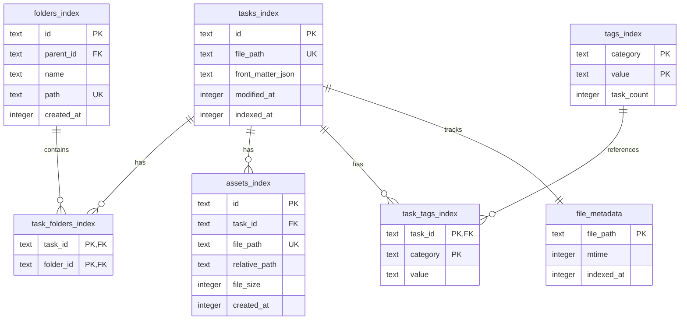

# Task-ARC-1.1: インデックススキーマ設計書

**作成日:** 2025-11-06  
**ステータス:** 設計完了  
**依存タスク:** なし

## 設計方針

### アーキテクチャ軌道修正（2025年11月5日）

- **SQLiteはプライマリではなく、インデックス/キャッシュとしてのみ機能**
- **Markdownファイルが唯一の真実の源（プライマリデータ）**
- **インデックスは削除されても100%再構築可能でなければならない**
- **ファイル名:** `.hienmark/cache.sqlite`

### 設計原則

1. **読み取り中心:** インデックスは主に検索・ソート・集計に使用
2. **再構築可能:** Markdownファイルから完全に再構築可能
3. **パフォーマンス:** 10,000ファイルでの検索・ソートを500ms未満に
4. **差分更新:** mtime比較による効率的な更新

---

## ER図



---

## テーブル定義（DDL）

### 1. tasks_index

タスクの基本情報とFront MatterのJSON表現を格納。

```sql
CREATE TABLE tasks_index (
    id TEXT PRIMARY KEY,
    file_path TEXT UNIQUE NOT NULL,
    front_matter_json TEXT NOT NULL,  -- Front Matter全体をJSON文字列として保存
    modified_at INTEGER NOT NULL,     -- Unix timestamp (UTC)
    indexed_at INTEGER NOT NULL,       -- インデックス更新日時 (Unix timestamp UTC)
    created_at INTEGER                -- ファイル作成日時 (Unix timestamp UTC)
);

CREATE INDEX idx_tasks_modified_at ON tasks_index(modified_at);
CREATE INDEX idx_tasks_indexed_at ON tasks_index(indexed_at);
```

**カラム説明:**
- `id`: タスクID（ファイル名、拡張子なし）
- `file_path`: ワークスペースルートからの相対パス（例: `tasks/task-001.md`）
- `front_matter_json`: Front Matter全体をJSON文字列として保存（`serde_json::to_string`）
- `modified_at`: ファイルの最終更新日時（mtime）
- `indexed_at`: インデックスに追加/更新された日時
- `created_at`: ファイルの作成日時（ctime、可能な場合）

**設計理由:**
- `front_matter_json`をJSON文字列として保存することで、タグの変更に対して柔軟に対応
- `file_path`をUNIQUE制約により、同一ファイルの重複登録を防止

### 2. folders_index

フォルダ階層構造を表現。ファイルシステムのディレクトリ構造に基づく。

```sql
CREATE TABLE folders_index (
    id TEXT PRIMARY KEY,              -- フォルダID（パスベースまたはUUID）
    parent_id TEXT,                   -- 親フォルダID（NULLの場合はルート）
    name TEXT NOT NULL,               -- フォルダ名
    path TEXT UNIQUE NOT NULL,        -- ワークスペースルートからの相対パス
    created_at INTEGER NOT NULL       -- 作成日時 (Unix timestamp UTC)
);

CREATE INDEX idx_folders_parent_id ON folders_index(parent_id);
CREATE INDEX idx_folders_path ON folders_index(path);
```

**カラム説明:**
- `id`: フォルダの一意識別子（パスベース: `"tasks/subfolder"` または UUID）
- `parent_id`: 親フォルダのID（自己参照外部キー、NULLはルートを示す）
- `name`: フォルダ名（例: `"subfolder"`）
- `path`: ワークスペースルートからの相対パス（例: `"tasks/subfolder"`）

**設計理由:**
- 階層構造を表現するためのparent_idによる自己参照
- パスベースのIDにより、ファイルシステム構造との整合性を維持

### 3. task_folders_index

タスクとフォルダの多対多関係を表現（タスクは複数のフォルダに所属可能、将来的な拡張）。

```sql
CREATE TABLE task_folders_index (
    task_id TEXT NOT NULL,
    folder_id TEXT NOT NULL,
    PRIMARY KEY (task_id, folder_id),
    FOREIGN KEY (task_id) REFERENCES tasks_index(id) ON DELETE CASCADE,
    FOREIGN KEY (folder_id) REFERENCES folders_index(id) ON DELETE CASCADE
);

CREATE INDEX idx_task_folders_task_id ON task_folders_index(task_id);
CREATE INDEX idx_task_folders_folder_id ON task_folders_index(folder_id);
```

**カラム説明:**
- `task_id`: タスクID（外部キー）
- `folder_id`: フォルダID（外部キー）

**設計理由:**
- 複合主キーにより、同一タスクの同一フォルダへの重複登録を防止
- CASCADE削除により、タスク削除時に自動的にリレーションを削除

### 4. assets_index

アセット（画像、ファイル等）のインデックス。`.hienmark/assets/`に保存されるアセットを管理。

```sql
CREATE TABLE assets_index (
    id TEXT PRIMARY KEY,              -- アセットID（UUIDまたはファイル名ベース）
    task_id TEXT NOT NULL,            -- 関連タスクID
    file_path TEXT UNIQUE NOT NULL,   -- アセットファイルのフルパス
    relative_path TEXT NOT NULL,     -- Markdown記法で使用する相対パス
    file_size INTEGER,                -- ファイルサイズ（バイト）
    mime_type TEXT,                   -- MIMEタイプ（例: "image/png"）
    created_at INTEGER NOT NULL,      -- 作成日時 (Unix timestamp UTC)
    FOREIGN KEY (task_id) REFERENCES tasks_index(id) ON DELETE CASCADE
);

CREATE INDEX idx_assets_task_id ON assets_index(task_id);
CREATE INDEX idx_assets_file_path ON assets_index(file_path);
```

**カラム説明:**
- `id`: アセットの一意識別子
- `task_id`: アセットが関連するタスクID
- `file_path`: アセットファイルの実際のファイルシステムパス
- `relative_path`: Markdown記法で使用する相対パス（例: `".hienmark/assets/image.png"`）
- `file_size`: ファイルサイズ（バイト）
- `mime_type`: MIMEタイプ（オプション）

**設計理由:**
- `relative_path`により、プロジェクト移動時もリンク切れを防止
- `task_id`による関連付けにより、タスク削除時にアセット情報も削除

### 5. tags_index

タグの集約情報（カテゴリ、値、使用タスク数）を格納。

```sql
CREATE TABLE tags_index (
    category TEXT NOT NULL,           -- タグカテゴリ（例: "status"）
    value TEXT NOT NULL,              -- タグ値（例: "pending"）
    task_count INTEGER DEFAULT 0,     -- このタグを持つタスク数
    PRIMARY KEY (category, value)
);

CREATE INDEX idx_tags_category ON tags_index(category);
CREATE INDEX idx_tags_task_count ON tags_index(task_count);
```

**カラム説明:**
- `category`: タグカテゴリ（Front Matterのキー）
- `value`: タグ値（Front Matterの値、文字列化）
- `task_count`: このタグを持つタスク数（集計値）

**設計理由:**
- 複合主キーにより、カテゴリと値の組み合わせの一意性を保証
- `task_count`により、タグ管理画面での集計処理を高速化

### 6. task_tags_index

タスクとタグの関連を表現。検索・フィルタリングの高速化に使用。

```sql
CREATE TABLE task_tags_index (
    task_id TEXT NOT NULL,
    category TEXT NOT NULL,
    value TEXT NOT NULL,              -- タグ値（文字列化）
    PRIMARY KEY (task_id, category, value),
    FOREIGN KEY (task_id) REFERENCES tasks_index(id) ON DELETE CASCADE
);

CREATE INDEX idx_task_tags_task_id ON task_tags_index(task_id);
CREATE INDEX idx_task_tags_category_value ON task_tags_index(category, value);
```

**カラム説明:**
- `task_id`: タスクID
- `category`: タグカテゴリ
- `value`: タグ値（文字列化）

**設計理由:**
- タスクのタグによる検索・フィルタリングを高速化
- 複合主キーにより、同一タスクの同一タグの重複登録を防止
- `category`と`value`の複合インデックスにより、タグによる検索を高速化

**注意事項:**
- `TagValue`（配列型タグ）の場合は、各要素を個別の行として登録
- 例: `tags: ["bug", "feature"]` → `(task_id, "tags", "bug")` と `(task_id, "tags", "feature")` の2行

### 7. file_metadata

ファイルのメタデータ（mtime、インデックス更新日時）を格納。差分更新に使用。

```sql
CREATE TABLE file_metadata (
    file_path TEXT PRIMARY KEY,       -- ファイルパス（ワークスペースルートからの相対パス）
    mtime INTEGER NOT NULL,           -- ファイルシステムの最終更新日時 (Unix timestamp UTC)
    indexed_at INTEGER NOT NULL,      -- インデックスに追加/更新された日時 (Unix timestamp UTC)
    file_size INTEGER,                -- ファイルサイズ（バイト）
    hash TEXT                         -- ファイルハッシュ（オプション、将来的な拡張）
);

CREATE INDEX idx_file_metadata_mtime ON file_metadata(mtime);
CREATE INDEX idx_file_metadata_indexed_at ON file_metadata(indexed_at);
```

**カラム説明:**
- `file_path`: ファイルパス（ワークスペースルートからの相対パス）
- `mtime`: ファイルシステムの最終更新日時
- `indexed_at`: インデックスに追加/更新された日時
- `file_size`: ファイルサイズ（オプション）
- `hash`: ファイルハッシュ（オプション、将来的な内容比較に使用）

**設計理由:**
- `mtime`と`indexed_at`の比較により、変更されたファイルのみを再パース
- 差分更新による起動時間の大幅短縮（10,000ファイルで500ms未満）

---

## インデックス設計

### 検索性能を確保するためのインデックス

| テーブル | インデックス名 | カラム | 用途 |
|---------|--------------|--------|------|
| `tasks_index` | `idx_tasks_modified_at` | `modified_at` | 更新日時順ソート |
| `tasks_index` | `idx_tasks_indexed_at` | `indexed_at` | インデックス更新日時順ソート |
| `folders_index` | `idx_folders_parent_id` | `parent_id` | フォルダ階層取得（子フォルダ一覧） |
| `folders_index` | `idx_folders_path` | `path` | パス検索 |
| `task_folders_index` | `idx_task_folders_task_id` | `task_id` | タスクの所属フォルダ取得 |
| `task_folders_index` | `idx_task_folders_folder_id` | `folder_id` | フォルダ内タスク一覧取得 |
| `assets_index` | `idx_assets_task_id` | `task_id` | タスクのアセット一覧取得 |
| `assets_index` | `idx_assets_file_path` | `file_path` | アセットパス検索 |
| `tags_index` | `idx_tags_category` | `category` | カテゴリ別タグ一覧取得 |
| `tags_index` | `idx_tags_task_count` | `task_count` | タスク数順ソート |
| `task_tags_index` | `idx_task_tags_task_id` | `task_id` | タスクのタグ一覧取得 |
| `task_tags_index` | `idx_task_tags_category_value` | `category, value` | タグによるタスク検索 |
| `file_metadata` | `idx_file_metadata_mtime` | `mtime` | mtime比較（差分更新） |
| `file_metadata` | `idx_file_metadata_indexed_at` | `indexed_at` | インデックス更新日時順 |

### 検索クエリ例

#### 1. タグによるタスク検索

```sql
-- ステータスが "pending" のタスクを取得
SELECT t.*
FROM tasks_index t
INNER JOIN task_tags_index tti ON t.id = tti.task_id
WHERE tti.category = 'status' AND tti.value = 'pending';
```

#### 2. 複数タグによるAND検索

```sql
-- ステータスが "pending" かつ優先度が "high" のタスクを取得
SELECT t.*
FROM tasks_index t
INNER JOIN task_tags_index tti1 ON t.id = tti1.task_id
INNER JOIN task_tags_index tti2 ON t.id = tti2.task_id
WHERE tti1.category = 'status' AND tti1.value = 'pending'
  AND tti2.category = 'priority' AND tti2.value = 'high';
```

#### 3. フォルダ階層の取得

```sql
-- 親フォルダIDから子フォルダ一覧を取得
SELECT *
FROM folders_index
WHERE parent_id = ?;
```

#### 4. フォルダ内タスク一覧取得

```sql
-- 特定フォルダ内のタスク一覧を取得
SELECT t.*
FROM tasks_index t
INNER JOIN task_folders_index tfi ON t.id = tfi.task_id
WHERE tfi.folder_id = ?;
```

#### 5. 更新日時順ソート

```sql
-- 更新日時が新しい順にタスクを取得
SELECT *
FROM tasks_index
ORDER BY modified_at DESC;
```

---

## スキーマバージョン管理

### バージョン管理テーブル

```sql
CREATE TABLE schema_version (
    version INTEGER PRIMARY KEY,     -- スキーマバージョン番号
    applied_at INTEGER NOT NULL,     -- 適用日時 (Unix timestamp UTC)
    migration_sql TEXT               -- マイグレーションSQL（ロールバック用）
);
```

### バージョン履歴

| バージョン | 日付 | 変更内容 |
|-----------|------|---------|
| 1 | 2025-11-06 | 初期スキーマ（全テーブル作成） |

### マイグレーション方針

1. **初回作成時:**
   - スキーマバージョン1として全テーブルを作成
   - `schema_version`テーブルにバージョン1を記録

2. **バージョンアップ時:**
   - `schema_version`テーブルを確認し、現在のバージョンを取得
   - 必要なマイグレーションSQLを順次実行
   - `schema_version`テーブルを更新

3. **ロールバック:**
   - `schema_version`テーブルの`migration_sql`を逆順に実行（将来的な拡張）

### マイグレーション実装例（Rust）

```rust
pub fn migrate_database(conn: &Connection) -> Result<(), rusqlite::Error> {
    let current_version = get_current_version(conn)?;
    
    if current_version < 1 {
        // 初回マイグレーション
        conn.execute_batch(INITIAL_SCHEMA)?;
        set_version(conn, 1)?;
    }
    
    // 将来のマイグレーションをここに追加
    // if current_version < 2 {
    //     conn.execute_batch(MIGRATION_V2)?;
    //     set_version(conn, 2)?;
    // }
    
    Ok(())
}
```

---

## データ整合性

### 外部キー制約

- `task_folders_index.task_id` → `tasks_index.id` (CASCADE DELETE)
- `task_folders_index.folder_id` → `folders_index.id` (CASCADE DELETE)
- `assets_index.task_id` → `tasks_index.id` (CASCADE DELETE)
- `task_tags_index.task_id` → `tasks_index.id` (CASCADE DELETE)

### 制約の有効化

SQLiteの外部キー制約を有効化するため、接続時に以下を実行:

```sql
PRAGMA foreign_keys = ON;
```

### 整合性チェック

定期的に（起動時など）以下の整合性チェックを実行:

```sql
-- 孤立したtask_folders_indexレコードを検出
SELECT * FROM task_folders_index
WHERE task_id NOT IN (SELECT id FROM tasks_index)
   OR folder_id NOT IN (SELECT id FROM folders_index);

-- 孤立したassets_indexレコードを検出
SELECT * FROM assets_index
WHERE task_id NOT IN (SELECT id FROM tasks_index);

-- 孤立したtask_tags_indexレコードを検出
SELECT * FROM task_tags_index
WHERE task_id NOT IN (SELECT id FROM tasks_index);
```

---

## パフォーマンス考慮事項

### 1. バッチ処理

- インデックス再構築時は、トランザクション内でバッチ処理を実行
- 10,000ファイルでも500ms未満の起動時間を目指す

### 2. WALモード

SQLiteのWAL（Write-Ahead Logging）モードを有効化:

```sql
PRAGMA journal_mode = WAL;
```

### 3. ページサイズ最適化

```sql
PRAGMA page_size = 4096;
```

### 4. 統計情報の更新

定期的に統計情報を更新:

```sql
ANALYZE;
```

---

## 実装チェックリスト

- [x] ER図作成
- [x] テーブルDDL作成
- [x] インデックス設計（検索性能確保）
- [x] ファイルメタデータテーブル設計（mtime比較用）
- [x] スキーマバージョン管理方針

---

## 参照

- [Task-ARC-1.1: インデックススキーマ定義](./task-arc-1.1-インデックススキーマ定義.md)
- [REQ-ARC-001: タスクリストのSQLite化](../../requirements/01-architecture.md#req-arc-001-タスクリストのsqlite化--未実装)

